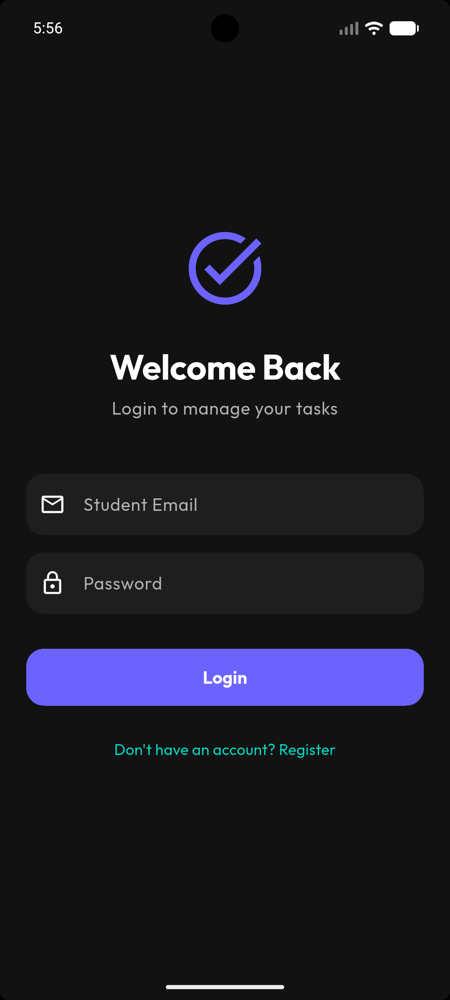
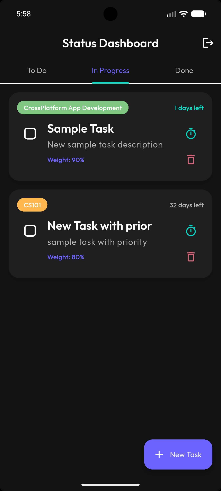
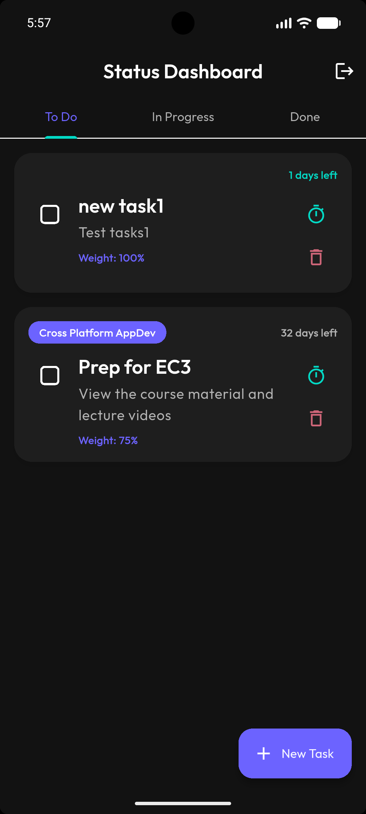
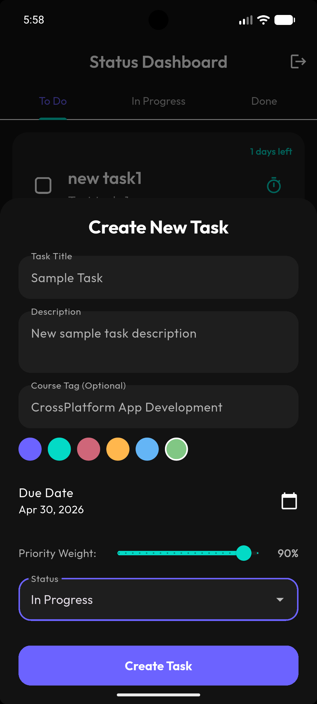
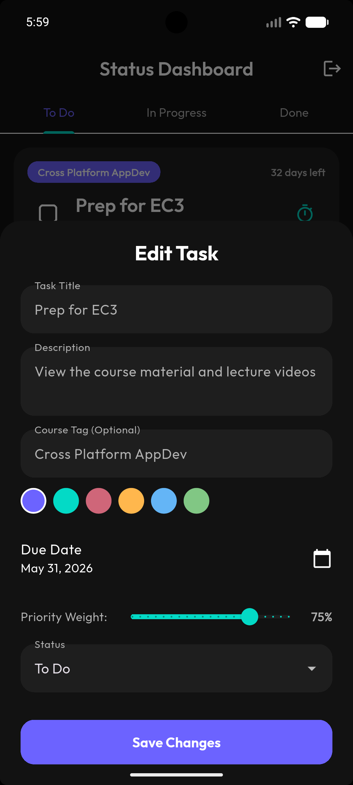
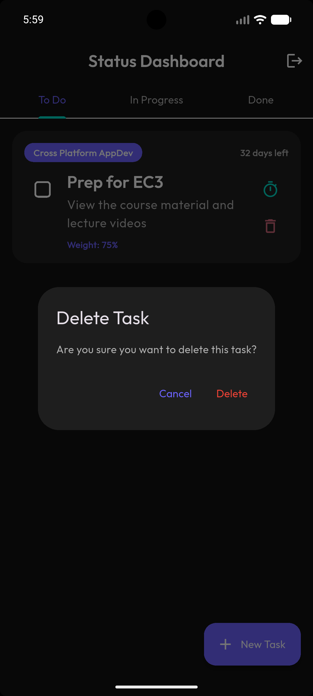
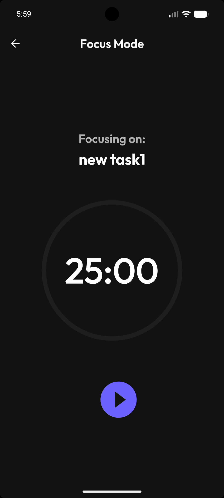

# Task Manager (Student Productivity Suite)

A beautifully designed, dark-themed, cross-platform task management application built with **Flutter** and powered by **Back4App (Parse Server)**. This app is meticulously crafted for students, featuring advanced academic tracking, deep-work Pomodoro timers, and gamification to keep motivation high and reduce "assignment anxiety."

## ✨ Features

- **Student-Centric Dashboard:** Organize tasks by "To Do", "In Progress", and "Done" using a sleek tabbed interface.
- **Academic Tagging:** Tag assignments by Course Name and Color, and assign Priority Weights (%) to keep track of what matters most.
- **Pomodoro Focus Mode:** A built-in 25-minute countdown timer integrated directly into every task card to encourage deep work.
- **Gamification Engine:** Earn XP for completing tasks and focus sessions to Level Up. Secure a Daily Login Streak to stay motivated!
- **Overdue Triage:** Automatically detects overdue tasks and provides a smart "Reschedule Assistant" to bulk-move them.
- **Offline-First Architecture:** Fully functional offline mode using local device caching (`CoreStoreSembast`). Tasks created offline sync seamlessly to Back4App once you're back online.

## 📸 Screenshots

<div align="center">
  
    &nbsp;&nbsp;&nbsp;
  
  &nbsp;&nbsp;&nbsp;
  
  &nbsp;&nbsp;&nbsp;
  
  &nbsp;&nbsp;&nbsp;
    
  &nbsp;&nbsp;&nbsp;
    
  &nbsp;&nbsp;&nbsp;
  
</div>

## 🛠 Tech Stack

- **Frontend:** [Flutter](https://flutter.dev/) (Dart)
- **Backend (BaaS):** [Back4App](https://www.back4app.com/) (Parse Server)
- **State Management:** `provider`
- **Animations:** `flutter_animate`
- **Local Storage:** `sembast` (via Parse CoreStore)

## 🚀 Getting Started

### Prerequisites
- Flutter SDK (v3.0.0+)
- A Back4App Account

### Installation

1. **Clone the repository:**
   ```bash
   git clone <your-repo-url>
   cd task_manager
   ```

2. **Install dependencies:**
   ```bash
   flutter pub get
   ```

3. **Configure Backend Integration:**
   Open `lib/core/constants.dart` and insert your specific Back4App credentials:
   ```dart
   class Constants {
     static const String back4appApplicationId = 'YOUR_APP_ID';
     static const String back4appClientKey = 'YOUR_CLIENT_KEY';
     static const String back4appServerUrl = 'https://parseapi.back4app.com';
   }
   ```

4. **Run the App:**
   ```bash
   flutter run
   ```

## 🎨 Theme Configuration

The app utilizes a centralized theme configuration found in `lib/core/theme.dart`. It uses a custom highly-polished Dark Mode aesthetic relying on smooth grays (`#121212`, `#1E1E1E`), Soft Indigo (`#6C63FF`), and Soft Emerald (`#03DAC6`) accents.
